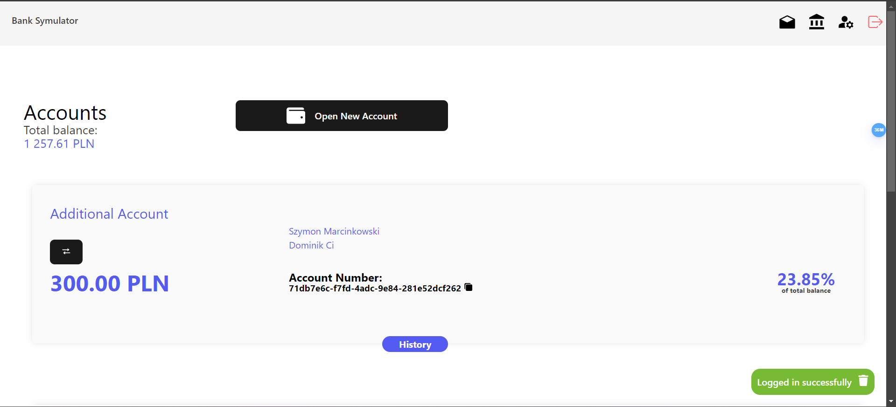
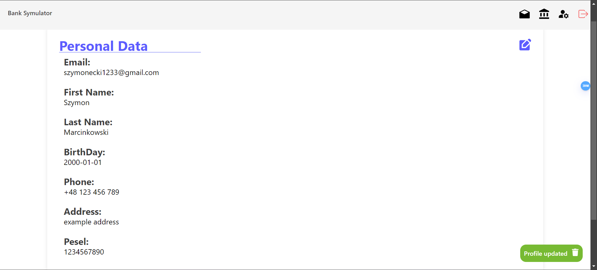
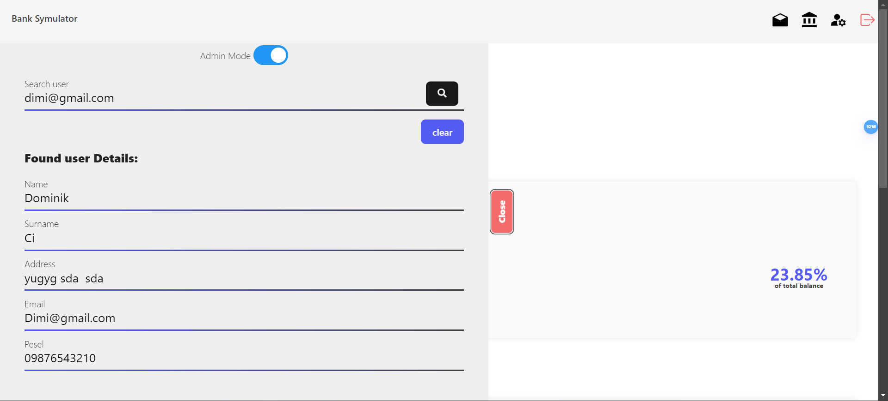
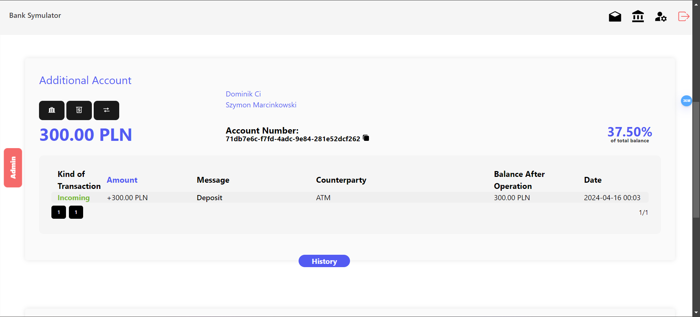

# Bank Simulator

This project consists of two main parts: the API and the client.

## Database Setup

This application uses Entity Framework Core for data access. Before running the application, you need to create the database.

Navigate to the `BankSymulatorApi` directory and run the following command:

```sh
dotnet ef database update
```

## BankSymulatorApi

This is the backend of the application, built with .NET. It contains the main logic for the bank simulator.

To run the API, navigate to the `BankSymulatorApi` directory and run:

```sh
dotnet run
```

The API will start on https://localhost:44397/.

## Banksymulatorclient

This is the frontend of the application, built with React and Vite.

To run the client, navigate to the banksymulatorclient directory and run:

```sh
npm run dev
```

The client will start on http://localhost:5173/.

Contributing
Pull requests are welcome. For major changes, please open an issue first to discuss what you would like to change.

License
GNU GPLv3

# How to use?

## User

Navigate to the client application running on http://localhost:5173/.
Click on the "Register" button on navbar.
Fill in the registration form with your details. This typically includes fields like username, email, and password.
Click on the "Register" button to submit the form.
Now you can log in and use application as user.

## As Admin

Register a user following the normal registration process.
Identify the user's ID in the `AspNetUsers` table.
Identify the admin role ID in the `AspNetRoles` table. The role name is typically "Admin".
Insert a new record in the `AspNetUserRoles` table with the user's ID and the admin role ID.

## Screenshots

Here are some screenshots of the application:

### Login Page


### Accounts Page



## History view


### Profile Page



### Applications Page


### Admin Page



### Admin View


